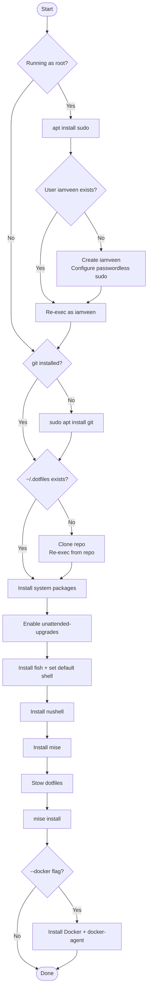

# Scripts

A single `install.sh` handles everything — bootstrapping a fresh machine and
re-applying config on an existing one.

## Usage

```sh
# Fresh machine, as root
curl -fsSL https://raw.githubusercontent.com/iamveen/dotfiles/main/scripts/install.sh | sh

# Fresh machine, as root, with docker
curl -fsSL https://raw.githubusercontent.com/iamveen/dotfiles/main/scripts/install.sh | sh -s -- --docker

# Already cloned, re-apply
sh ~/.dotfiles/scripts/install.sh
sh ~/.dotfiles/scripts/install.sh --docker
```

## Flow


